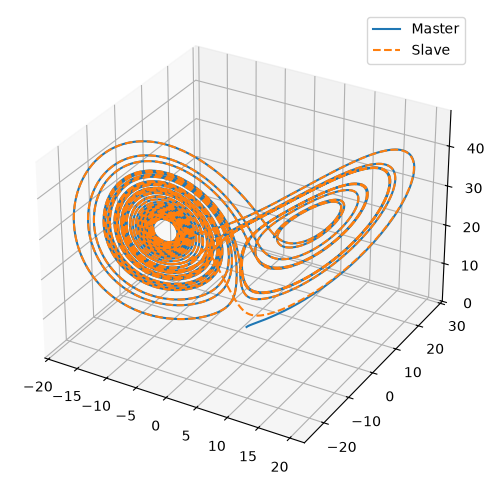
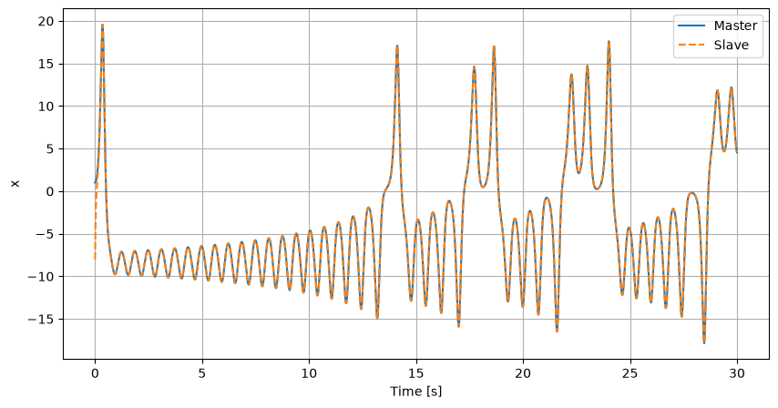
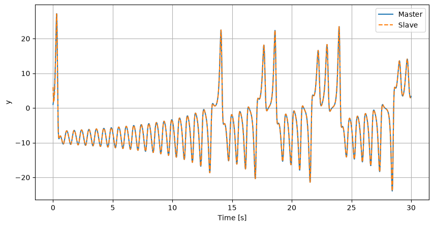
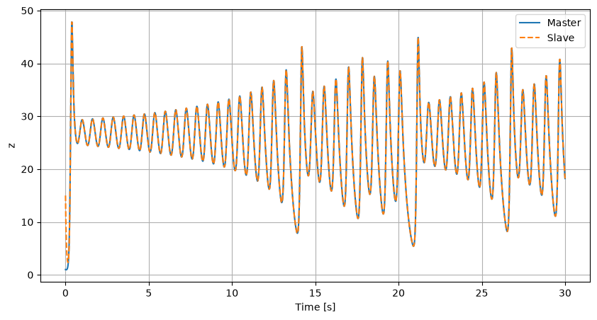
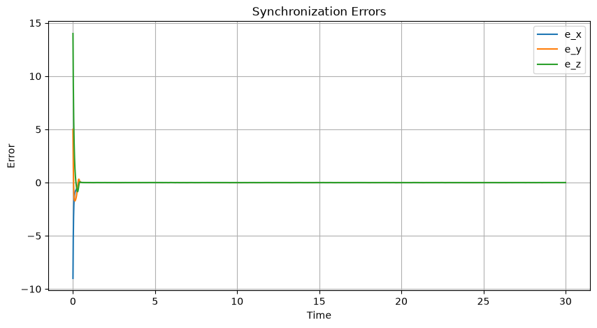

# ChaosSyncPy

A modular Python framework for chaotic/hyperchaotic synchronization, nonlinear control, disturbance analysis, and dynamical systems research.

<p align="center">
  
</p>

## Overview

ChaosSyncPy is a flexible and extensible framework for the simulation and synchronization of nonlinear and chaotic/hyṕerchaotic dynamical systems.

A key feature of the framework is its **dimension-agnostic design**, allowing the implementation of dynamical systems with an arbitrary number of state variables. This makes it suitable not only for classical low-dimensional chaotic systems (such as the Lorenz system), but also for higher-dimensional or augmented systems, including those with additional control states, observers, or learning-based components.

The project provides a modular architecture for implementing master-slave synchronization schemes, control laws, disturbances, and numerical integration methods.

The framework is intended for researchers, students, and engineers working in areas such as:

* Chaotic systems
* Nonlinear control
* Synchronization
* Dynamical systems
* System identification

---

## Features

* Modular architecture
* Master-slave synchronization framework
* Configurable numerical solvers (`RK45`, `BDF`, `Radau`, etc.)
* Configurable disturbances
* Error convergence analysis
* Attractor visualization
* Easily extensible to new dynamical systems and controllers

---

## Installation

Clone the repository:

```bash
git clone https://github.com/felipeofugi/ChaosSyncPy.git
cd ChaosSyncPy
```

Create and activate a virtual environment:

```bash
python3 -m venv .venv
source .venv/bin/activate
```

Install the required packages:

```bash
pip install -r requirements.txt
```

---

## Running a Simulation

Define the state names and the plant of the dynamic system to be simulated in:

```text
src/system.py
```

Enter the initial conditions of the master and slave systems and the type of disturbance in:

```text
main.py
```

Edit the disturbances in:

```text
src/disturbances.py
```

Set the control signal in:

```text
src/controller.py
```

Execute:

```bash
python main.py
```

The graphs will be generated in the figures directory.

Simulation parameters can be configured in:

```text
src/config.py
```

---

# Implemented Systems (Example)

## Lorenz System

The Lorenz system is one of the most studied chaotic systems and is defined by:

$$
\dot{x} = \sigma (y - x)
$$

$$
\dot{y} = x(\rho - z) - y
$$

$$
\dot{z} = xy - \beta z
$$

where:

- $\sigma = 10$
- $\rho = 28$
- $\beta = 8/3$

---

### Master-Slave Synchronization

The framework supports synchronization between a master and a slave Lorenz system through a configurable control law.

#### States

<p align="center">
  
</p>
<p align="center">
  
</p>
<p align="center">
  
</p>

---

#### Synchronization Error

<p align="center">
  
</p>

---

#### Attractors

<p align="center">
  
</p>

---

## Project Structure

```text
ChaosSyncPy/
│
├── figures/
├── src/
│   ├── config.py
│   ├── controller.py
│   ├── disturbances.py
│   ├── plots.py
│   ├── synchronization.py
│   ├── system.py
│   └── __init__.py
│
├── main.py
├── requirements.txt
├── LICENSE
└── README.md
```

---

## License

This project is distributed under the MIT License.

---

## Citation

If you use this project in academic research, please consider citing the repository in your publications.
